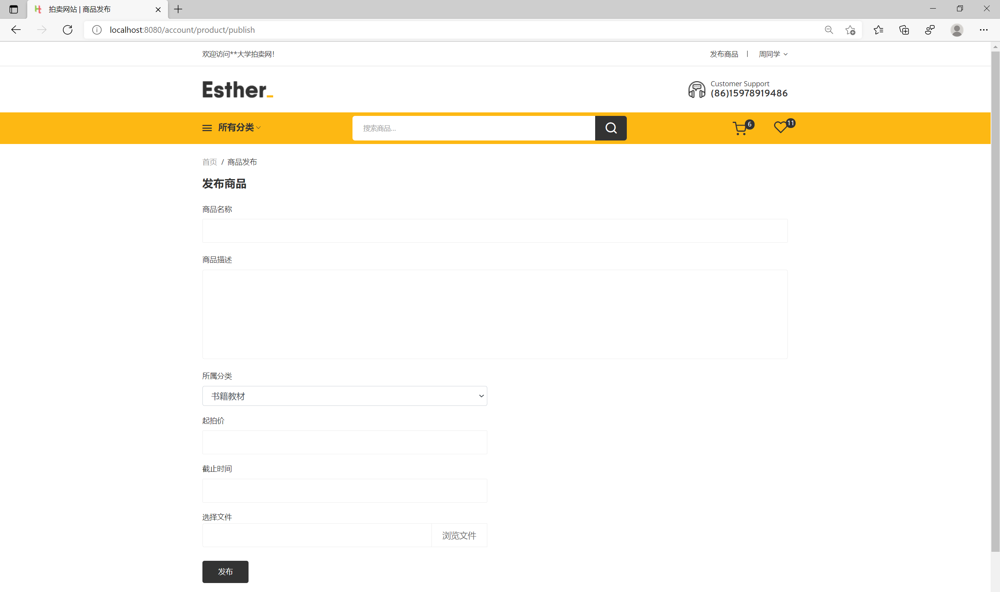

## 基于SSM框架的网上拍卖商城(程序+报告)

###  获取sql数据库文件: 从戎源码网 (https://armycodes.com/) QQ: 386869957 QQ群: 377586148
###  所有系统地址: (https://github.com/YuLin-Coder/AllProjectCatalog) 
###  所有项目以及源代码本人均调试运行无问题 可支持远程安装部署调试、定制修改、代码讲解

## 项目介绍
基于SSM框架的网上拍卖商城，项目分为个角色，主要功能如下
用户可以实现浏览及搜索竞拍商品、加入购物车、竞拍商品、发布拍卖商品、订单支付、个人信息管理功能
平台管理员可以实现用户管理、商品信息管理、竞拍记录管理、订单管理、个人信息管理、退出功能

## 项目技术
- 编程语言：Java
- 数据库：MySQL
- 前端技术：JSP、JavaScript、jquery
- 后端技术：Spring、SpringMVC、MyBatis

## 运行环境
- JDK版本：JDK1.8及以上
- 开发工具：IDEA、Ecplise、Myecplise都可以
- 数据库: MySQL5.7及以上

## 运行截图

